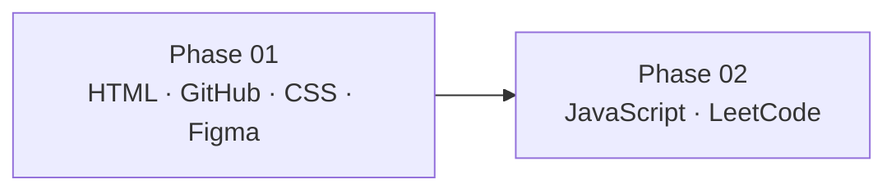

# A Step Into Web Development

**Course documentation** · *From first HTML tag through JavaScript foundations*

> A structured **6 week** journey from HTML and CSS through JavaScript and LeetCode practice.

---

## 📋 Course at a glance

| | |
|:---|:---|
| **Course title** | A Step Into Web Development |
| **Duration** | 6 weeks |
| **Format** | Phased curriculum with daily topics and hands-on practice |

---

## 👥 Leadership & delivery team

| Role | Name(s) |
|:---|:---|
| **Supervisors** | Usama Zafar |
| **Trainers** | Alisha Fatima, Sikander Nawaz, Tabinda Noor |
| **Moderators** | Aliza Tariq, Laika Butt, Mubir Shami |

---

## 🗺️ Learning roadmap

| Phase | Focus | Weeks |
|:---:|:---|:---:|
| **01** | 🎨 HTML, GitHub, CSS, Figma | 01–03 |
| **02** | ⚡ JavaScript, LeetCode | 04–06 |

---

## 🎨 Phase 01 — HTML, GitHub, CSS & Figma

*Foundations of the web, version control, styling, and design handoff.*

### 📅 Week 01

| Day | Topics |
|:---:|:---|
| **D1** | How websites work · HTML introduction · IDE setup |
| **D2** | HTML structure · Comments · Case sensitivity · Whitespace |
| **D3** | Text (structural & semantic markup) · Links (images, external sites, paths) |
| **D4** | Lists (ordered, unordered, definition, nested) |
| **D5** | Tables · Forms |

### 📅 Week 02

| Day | Topics |
|:---:|:---|
| **D1** | Flash · Audio · Video |
| **D2** | GitHub · Q&A |
| **D3** | CSS foundations |
| **D4** | Selectors & text styling |
| **D5** | Box model & display |

### 📅 Week 03

| Day | Topics |
|:---:|:---|
| **D1** | Position · Flexbox & Grid |
| **D2** | Responsive design & effects |
| **D3** | Tailwind CSS · Q&A |
| **D4** | Figma |
| **D5** | Figma |

---

## ⚡ Phase 02 — JavaScript & LeetCode

*Core programming, the DOM, modern JS, and problem-solving practice.*

### 📅 Week 04

| Day | Topics |
|:---:|:---|
| **D1** | JavaScript introduction · Variables · Data types |
| **D2** | Type casting · Operators |
| **D3** | Conditionals · Ternary operator |
| **D4** | Loops (`while`, `do-while`, `for`) |
| **D5** | Arrays & strings (with methods) |

### 📅 Week 05

| Day | Topics |
|:---:|:---|
| **D1** | Objects & methods · Nested objects · JSON |
| **D2** | Functions |
| **D3** | Event listeners · Local storage |
| **D4** | DOM selection · DOM manipulation · Class list |
| **D5** | Event bubbling & delegation |

### 📅 Week 06

| Day | Topics |
|:---:|:---|
| **D1** | ES6+ (destructuring, spread/rest) · Iteration (`forEach`, `map`, `find`, `filter`) |
| **D2** | Scope · Hoisting |
| **D3** | Async/await · Promises |
| **D4** | LeetCode |
| **D5** | LeetCode |

---

## 📌 Legend

| Symbol | Meaning |
|:---:|:---|
| **D1–D5** | Monday–Friday style daily sessions (adjust to your cohort calendar) |
| **Q&A** | Questions, review, and clarification sessions |

---

*This document reflects the official course outline. Weekly labels align with the phased roadmap; exact calendar dates are set by the program team.*
